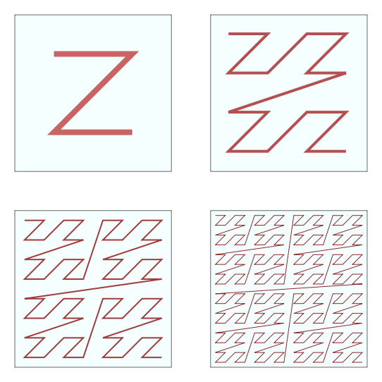

# Ordering an STM

STMTools supports (re)ordering the elements in an STM.


## Why element order is important

The data elements in an STM can be ordered according to a wide variety aspects, such as time, horizontal before vertical, or classification. The choice of order can have a significant impact on the performance of operations applied to the data.

An important consideration is that operations often don't have to be applied to the complete dataset. An STM is always loaded per chunk, so it can be beneficial to collect elements in a chunk that should be processed together.

Our operations often prefer elements to be ordered by spatial coherency. For example, to enrich or subset an STM, the element positions will have to be compared to polygons. Ideally, we only want to process elements that are near the query polygon.


## How are elements reordered

When applying spatial ordering, we order the elements according to their Morton code. A Morton code is a single integer representation of a higher dimensional coordinate. The following image shows a few sequences of Morton codes as a polyline for a few small sets of 2D points.



The translation to Morton code can be direct when the point coordinates are integers, such as pixel coordinates. Floating point coordinates must be scaled and truncated to integer values first. The choice of scale factor determines the resolution of the Morton code.

Note that for a detailed dataset, a close group of points could be assigned the same Morton code, depending on the choice of scale factor. These points will be grouped together after ordering, but their internal order will not be strictly determined. In other words, we cannot detemine beforehand what their order will be, but they will not be separated by points with a different Morton code.


## Ordering existing stmat

Reordering an existing STM is very straightforward.
If the coordinates are integer values, such as the pixel coordinates `X` and `Y`, the STM can be reordered as follows:

```python
stmat_ordered = stmat_xy.stm.reorder(xlabel='X', ylabel='Y')
```

If the coordinates are floating point coordinates, such as longitude and latitude, you must choose a scale factor for each coordinate such that points that are at least a unit distance apart in either direction can be differentiated by their Morton code. For example, a scale factor of ```1.1*10^5``` on the latitude coordinate means that points that are at least 1 meter apart will be assigned a different Morton code.

```python
stmat_ordered = stmat_lonlat.stm.reorder(xlabel='lon', ylabel='lat', xscale=1.5*(10**5), yscale=1.7*(10**5))
```

Reordering the STM is actually a two-step process: computing the Morton codes and sorting the STM. You can also apply these steps separately:

```python
stmat_ordered = stmat_ar.stm.get_order(xlabel='azimuth', ylabel='range', xscale=15, yscale=17)
stmat_ordered = stmat_ordered.sortby(stmat_ordered.order)
```


## Ordering new stmat

Reading and writing data to disk can cost a significant amount of time. It is usually beneficial not to overwrite existing data unless necessary. If you intend to apply spatial ordering to your STM, we advise doing so before writing your data to disk.

The following example selects some points of a sarxarray, reorders then, and only then writes them to disk:

```python
stmat = stack.slcstack.point_selection(threshold=0.25, method='amplitude_dispersion')
stmat = stmat.stm.reorder(xlabel='azimuth', ylabel='range', xscale=15, yscale=17)
stmat.to_zarr('stm.zarr')
```


## Effect on processing time

The example notebooks contain an example of the effect or ordering the STM on processing time: [Example Ordering notebook](./notebooks/demo_order_stm.ipynb)
